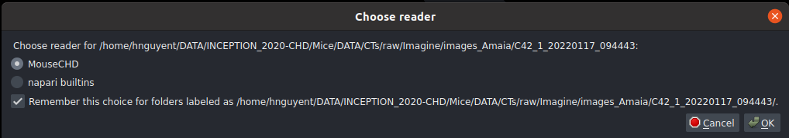
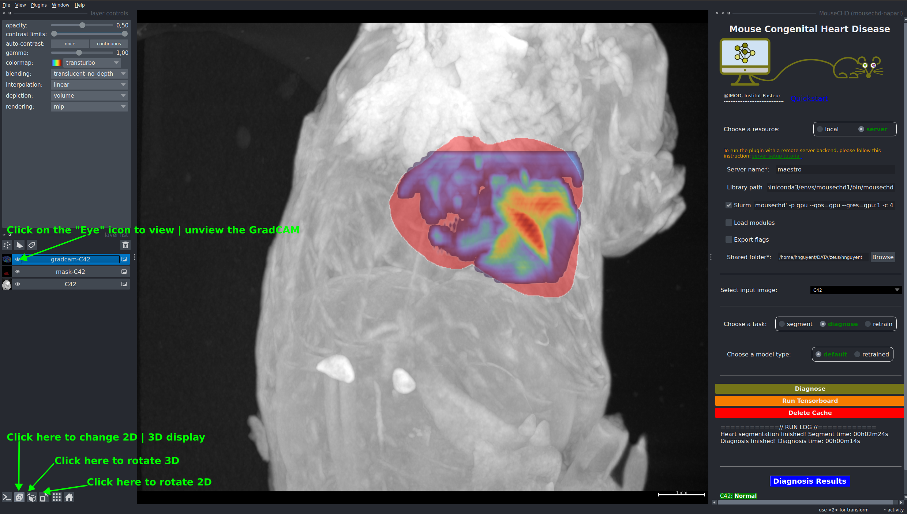

# How to use MouseCHD Napari plugin

* Tutorial video: [Quick start](https://drive.google.com/file/d/1nQBw5jj3VtRH8pFlDuih_lmWLfwtr69M/view?usp=sharing)
* Common issues: [Common issues](./issues.md)
* Report issues: [Issues](https://github.com/hnguyentt/mousechd-napari/issues)

This plugin serves as a tool for heart segmentation and the detection of congenital heart disorders in mice. You can execute the plugin utilizing the resources of either your local machine or a remote server.

The segmentation step necessitates GPU acceleration. If your local machine lacks a GPU, consider offloading the computation to a remote server with GPU support. Refer to [server_setup.md](server_setup.md) for more detail.

## Open MouseCHD Plugin
1. Open Napari
2. On the upper-left conner, choose `Plugin` &rarr; `MouseCHD`

## Load data
### Sample data
For quick test, you can use sample data provided by MouseCHD Napari plugin: `File` &rarr; `Open Sample` &rarr; `microCTscan`

### Load your own data
* Drag and drop your data on the image display area. Supported format: DICOM folder, NRRD, NIFTI.
* Choose `MouseCHD` as the reader

## Diagnose
1. Choose a resource to run on. If you choose server, please setup your local machine and remote server, following [this instruction](server_setup.md).
2. Choose a scan to predict
3. Click on `Diagnose` button

## View GradCAM

Watch: [Quickstart (1:30 - 1:58)](https://www.youtube.com/watch?v=RT6mIovz7sw)

## Retrain
1. Choose a resource to run on. If you choose server, please setup your local machine and remote server, following [this instruction](server_setup.md).
2. Choose retrain as a task
3. Choose data directory. If you choose to run on server, this directory must be placed on the shared folder.
4. You can modify output, experiment name, and number of retraining epochs.
5. If you choose to run on server, you can also choose to run the preprocessing step either on local or server.
6. Click on retrain button.

As the retraining begins, you can also click on <b>Run Tensorboard</b> to monitor your training progress.

Watch: [Quickstart (1:59 - 2:43)](https://www.youtube.com/watch?v=RT6mIovz7sw)

## Diagnose with retrained model
1. Choose a resource to run on. If you choose server, please setup your local machine and remote server, following [this instruction](server_setup.md).
2. Choose a scan to predict
3. Choose diagnose as a task.
4. Choose retrained in the model type option.
5. Browse the custome model path.
6. Click on Diagnose button.

Watch: [Quickstart (2:43 - 3:43)](https://www.youtube.com/watch?v=RT6mIovz7sw)

## Delete cache
When executing the 'Retrain' task, intermediary files such as processed data, heart masks, and resampled data are stored. While this can enhance speed, it may consume a significant amount of storage space. To clear the cache and free up space, simply click on the  <b>Delete Cache</b> button.